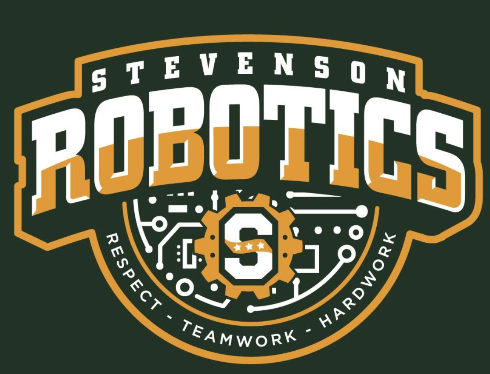

# **Steel Team 7**

Stevenson 1965Y 2019-2020

Competition styled for Vex EDR [Tower Takeover](https://www.vexrobotics.com/vexedr/competition/vrc-current-game "VEX Current Game"). Coded with [VEXCode V5 Text](https://www.vexrobotics.com/vexcode "VEXCode V5") in C++.
Find this code [here](https://www.github.com/IyadHamid/StevensonVex1965Y-ChangeUp "Stevenson 1965Y Repository") on GitHub!

## **The Team:**

- Adam Taylor
- Andrei Nistor
- Iyad Hamid - *Primary Coder*
- Jonathan Burrer
- Joshua Neela
- Neil Thakker
- Tanmay Panchpor
	
## **Functionality**

- TBD

## **Robot Configuration**

|Name            | Type       | Port(s)  |
|:---------------|:-----------|:---------|
|`Controller    `| controller |          |

# *...because it "just works".*
